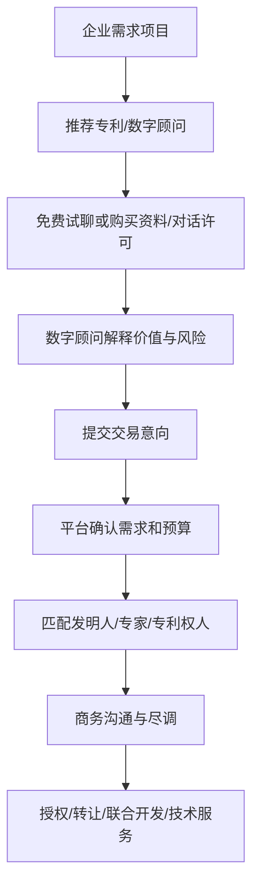

# ScholarMate 产品与商业模式说明书

版本：v0.4 静态原型版  
日期：2026-05-08  
适用对象：导师评审、早期合作方沟通、产品路演、企业访谈前置材料

## 1. 产品一句话

ScholarMate 是一个面向买方企业的专利技术转化与数字顾问平台。它以企业真实技术需求为入口，通过企业认证、会员服务包、需求项目、专利推荐、数字顾问对话、资料/对话许可和交易意向，帮助企业从“看不懂专利”走向“能判断适配、能继续商务沟通”。

## 2. 产品定位

ScholarMate 不只是专利列表，也不是单纯的 AI 聊天工具。

它的核心定位是：

- 面向买方企业的技术需求转化入口
- 专利与企业需求之间的智能匹配层
- 数字发明人/数字顾问驱动的解释与转化工具
- 早期交易意向收集和后续商务跟进入口

当前版本采用 B + C 混合商业路径：

- 短期：通过买方企业会员、Token、顾问席位、资料/对话许可形成付费闭环。
- 长期：通过企业技术需求驱动专利推荐、专家服务和真实交易转化。

## 3. 背景问题

专利交易和技术转化通常存在几个痛点：

1. 企业很难从专利文本判断真实商业价值。  
   专利语言偏法律和技术，企业更关心落地成本、适配场景、风险和下一步合作方式。

2. 传统专利平台以“检索”为主，缺少需求驱动。  
   企业不是先知道要找哪件专利，而是先有业务问题、技术痛点或采购/试点需求。

3. 发明人与企业之间存在沟通翻译成本。  
   发明人讲技术，企业讲场景、预算、周期和风险，中间缺少一个能持续解释和转化的顾问层。

4. 专利授权交易链条太重，早期探索门槛高。  
   企业在愿意进入正式授权、转让或合同前，往往需要先低成本理解资料、问清边界、评估匹配度。

ScholarMate 的第一阶段目标不是直接完成完整法律交易，而是把“需求 -> 推荐 -> 理解 -> 意向”的前半段链路做顺。

## 4. 目标用户

### 4.1 买方企业

主要用户是有技术升级、产品研发、采购调研或试点需求的企业。

典型场景包括：

- 基层医院希望提升影像诊断效率
- 新能源企业关注电池高温安全和热失控
- 制造企业希望做缺陷检测、能耗调度或机器人协作
- 园区或工厂希望做碳排放核算、节能诊断
- 农业企业希望做病虫害识别和精准灌溉

### 4.2 专利持有人/科研团队

当前原型以买方企业为主，专利发布方功能暂时较轻。

未来专利持有人可以作为供给侧用户：

- 发布专利和技术资料
- 维护数字发明人知识库
- 接收企业需求匹配和交易意向
- 参与专家咨询或后续商务沟通

### 4.3 平台运营方

平台运营方负责：

- 专利数据治理
- 企业需求审核和分发
- 专家/发明人服务组织
- 交易意向跟进
- 会员、许可和交易转化运营

## 5. 核心价值主张

### 对买方企业

- 用业务语言理解专利价值，而不是只看专利摘要。
- 从技术需求出发获得推荐，减少盲目搜索。
- 先通过资料/对话许可低成本探索，再决定是否进入正式交易。
- 可以保存长期数字顾问，围绕同一需求持续沟通。
- 交易意向与需求项目绑定，方便后续专家跟进。

### 对专利持有人

- 让专利被企业需求主动发现，而不是被动等待检索。
- 用数字发明人降低重复解释成本。
- 将早期咨询沉淀为可跟进的交易线索。
- 未来可通过资料许可、专家咨询、交易服务费获得收益。

### 对平台

- 通过会员、Token、资料/对话许可建立短期收入。
- 通过交易意向和真实商务转化建立长期收入。
- 通过需求项目和对话数据沉淀供需匹配资产。

## 6. 产品主流程


## 7. 权限与分级解锁

| 用户状态 | 可用能力 | 商业意义 |
|---|---|---|
| 未登录用户 | 浏览首页、专利列表、部分详情 | 降低首次访问门槛 |
| 注册企业 | 收藏、创建少量需求、免费共享专利试聊 | 建立基础用户状态 |
| 已认证企业 | 购买会员、购买资料/对话许可、提交交易意向 | 进入商业闭环 |
| 专业版/企业版会员 | 更多需求项目、更多 Token、长期顾问席位、交易跟进 | 形成买方服务包收入 |
| 已购资料/对话许可用户 | 解锁单项付费专利的深度问答与顾问资产 | 形成单项许可收入 |

认证采用“小额打款验证”的产品逻辑。当前原型中为前端模拟，正式版应接入真实企业认证、对公账户校验或第三方工商/支付能力。

## 8. 会员服务包设计

会员不是“买数字人”，而是买方企业围绕技术需求使用平台的服务能力。

| 套餐 | 价格口径 | 技术需求项目 | 长期顾问席位 | Token | 主要价值 |
|---|---:|---:|---:|---:|---|
| 免费认证版 | 免费 | 2 个 | 0 个 | 每日 100 | 基础推荐、免费共享专利试聊 |
| 专业版 | ¥299/年 | 8 个 | 10 个 | 每日 500 | 深度推荐、长期顾问席位、资料许可折扣 |
| 企业版 | ¥799/年 | 30 个 | 不限 | 每日 2000 | 团队化预留、优先推荐、交易意向优先跟进 |

会员价值锚点是“技术需求项目”。顾问席位和 Token 是围绕需求项目持续消耗和沉淀的服务资源。

## 9. 资料/对话许可

资料/对话许可是第一阶段的轻量付费单元，不等于法律意义上的专利授权、转让或实施许可。

购买后解锁：

- 当前付费专利的深度数字顾问问答
- 技术资料摘要
- 匹配分析
- 交易意向入口
- 该专利对应的数字顾问资产

价格口径：

- 普通付费：¥1,999/年
- 标准付费：¥2,999/年
- 高价值付费：¥3,999/年

免费共享专利不展示许可价格，显示“免费共享 / 可先沟通”。

## 10. 数字顾问产品逻辑

数字顾问不是孤立聊天，而是服务于企业技术需求项目的顾问式交互。

它需要理解：

- 企业画像
- 当前需求项目
- 当前专利上下文
- 会员状态和许可状态
- 交易下一步

回答目标：

- 解释专利价值
- 判断需求匹配度
- 提醒落地门槛
- 提示商业风险
- 引导提交交易意向

当前原型支持：

- 本地模拟回复
- OpenAI-compatible LLM 演示配置
- 多会话保存
- 我的数字顾问资产
- 会员顾问席位与单项许可顾问资产区分

正式版应把 LLM Key 放在后端，不应暴露在浏览器前端。

## 11. 推荐系统逻辑

当前推荐采用混合检索：

- 语义向量：浏览器端 Transformers.js + `Xenova/multilingual-e5-small`
- 字段权重：行业、技术领域、阶段、预算、关键词
- 商业规则：免费共享、已购许可、会员权益
- 相关性门槛：商业加权只能在基础相关性达标后生效

推荐结果展示：

- 匹配分数
- 推荐理由
- 适配场景
- 风险提示
- 下一步动作

产品原则是“宁可少而准，不硬凑 Top 5”。例如搜索“人工智能与医疗”时，应优先推荐医疗 AI 或医疗数据相关专利，而不是所有含“人工智能”的专利。

## 12. 商业模式

### 12.1 短期收入

1. 买方企业服务包  
   通过专业版和企业版会员收取年费。

2. Token 与顾问使用额度  
   当前作为会员权益展示，后续可以扩展为加量包或团队额度。

3. 资料/对话许可  
   对付费专利收取年度资料与深度问答许可费用。

4. 专家预约或真人顾问  
   当前为门禁演示，未来可按次、按项目或按企业服务包收费。

### 12.2 长期收入

1. 交易服务费  
   当企业需求转化为真实授权、转让、联合开发或技术服务时，平台抽取服务费。

2. 供给侧增值服务  
   为高校、科研团队、专利持有人提供专利包装、数字发明人配置、需求线索分发等服务。

3. 企业技术情报服务  
   基于需求项目、行业趋势和专利图谱提供订阅型技术情报。

4. 私有化或行业版部署  
   面向园区、高校技术转移中心、产业联盟或大型企业提供定制部署。

## 13. 交易闭环



当前原型完成 A-E，F-I 留给后续真实商务系统。

## 14. 当前原型已具备的能力

- 响应式网页和手机版预览
- 企业注册和模拟小额打款认证
- 买方企业会员服务包
- 技术需求项目
- 需求文本上传和解析
- 28 条演示专利数据
- 自然语言搜索和混合推荐
- 免费共享/付费许可价格区分
- 数字顾问资产和多会话
- 本地模拟回复和可选真实 LLM 演示
- 交易意向本地保存
- GitHub Pages 静态部署准备

## 15. 当前限制

当前版本是静态前端原型，主要用于产品逻辑验证。

尚未包含：

- 真实用户系统
- 真实后端数据库
- 真实支付
- 真实企业认证
- 真实专利数据库
- 真实文件解析
- 正式合同、授权或转让流程
- 后台 CRM 和专家排班
- 权限审计与日志

所有状态保存在浏览器本地，换浏览器或清缓存后会丢失。

## 16. 下一阶段路线图

### 阶段 1：可演示原型

目标：验证业务闭环和交互逻辑。

已完成：

- 买方企业主流程
- 会员与许可口径
- 需求推荐
- 数字顾问会话
- GitHub Pages 部署准备

### 阶段 2：最小可用后端

目标：让真实测试用户可持续使用。

建议补充：

- 用户登录与企业认证状态
- 需求项目数据库
- 专利数据管理
- 交易意向后台
- LLM 后端代理
- 文件上传与文本解析

### 阶段 3：交易运营系统

目标：支持真实商务跟进。

建议补充：

- 专家/发明人工作台
- 交易意向分配
- 客户跟进记录
- 合同与资料权限管理
- 支付、发票和订单

### 阶段 4：行业化与规模化

目标：形成可复制商业模式。

可探索方向：

- 医疗健康专版
- 新能源专版
- 高校技术转移中心版
- 园区企业服务版
- 大企业内部技术情报版

## 17. 核心指标

产品验证阶段建议关注：

- 企业完成认证率
- 需求项目创建率
- 每个需求项目推荐点击率
- 数字顾问启动率
- 平均会话轮数
- 资料/对话许可购买率
- 交易意向提交率
- 交易意向到人工跟进转化率

长期商业阶段建议关注：

- 会员付费转化率
- 会员续费率
- 单企业年收入
- 需求到交易转化率
- 真实授权/转让/技术服务成交额
- 平台服务费收入

## 18. 风险与应对

| 风险 | 表现 | 应对方向 |
|---|---|---|
| 推荐不准 | 企业觉得结果无关 | 增加真实专利数据、需求结构化、行业词表和人工反馈 |
| 数字顾问不可信 | 回答泛泛而谈 | 引入专利资料、企业需求和专家审核提示词 |
| 交易链条过重 | 用户只看不成交 | 先做轻量资料/对话许可和交易意向 |
| 数据安全风险 | 企业需求和 LLM Key 敏感 | 正式版使用后端代理、权限控制和日志审计 |
| 法律边界风险 | 误把资料许可理解成专利授权 | 页面和合同明确区分“资料/对话许可”和“正式专利授权” |

## 19. 对外沟通口径

可以这样介绍 ScholarMate：

ScholarMate 是一个面向企业技术需求的专利转化平台。企业不是被动搜索专利，而是先提交自己的技术问题和落地场景；平台再推荐相关专利和数字顾问，帮助企业理解专利价值、落地门槛和交易下一步。短期通过买方企业服务包和资料/对话许可形成收入，长期通过企业需求驱动真实专利授权、转让和技术服务转化。

## 20. 结论

ScholarMate 第一阶段验证的不是“专利列表能不能展示”，而是“企业需求能不能驱动专利推荐和交易意向”。产品的关键闭环是：

```text
企业认证 -> 会员服务包 -> 技术需求项目 -> 专利/顾问推荐 -> 资料/对话许可 -> 数字顾问深聊 -> 交易意向 -> 商务跟进
```

只要这个链路成立，平台就可以从静态原型继续演进为真实的企业技术转化产品。
